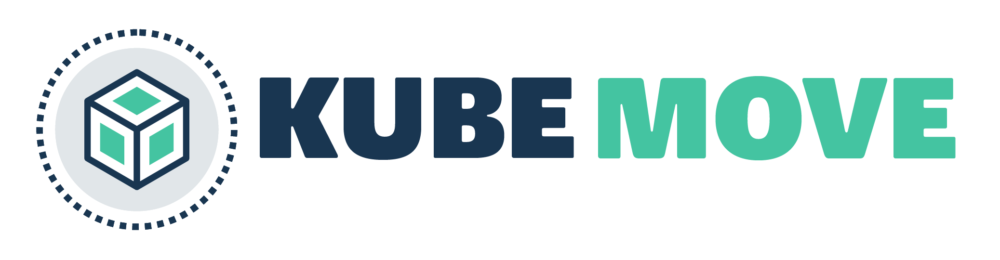

# Overview

Workloads running on Kubernetes do not make assumptions about the underlying infrastructure. However,  it is still non-trivial to move them across different clusters. It is also non trivial to move them to another namespace within the same cluster scope such as to a different zone. KubeMove provides a set of tools and API to coordinate the orchestration and workflow of moving an application in production across cluster or namespace boundaries. 

# Architecture/Design proposal

The initial KEP (KubeMove Enhancement Proposal) is at [KEP-1](<https://github.com/kubemove/kubemove/blob/master/keps/0001-kep-kubemove-hld.md>)

Join the discussion through the issue [here](<https://github.com/kubemove/kubemove/issues/14>)

# Using Kubemove

- Install kubemove using helm - `helm install kubemove.io/kubemove`
- Annotate the application to be moved with `kubemove.io/kubemove.enable="true"`
- Use `MoveEngine` API with the required configuration to start the data movement or sync
- Wait for the movement or datasync to complete  and switch the application on the target cluster using `MoveSwitch` API

# CLI

**Example move commands:**

`kubectl km move init <app> <kubemove-template.yaml>`

`kubectl km status <movepair-cr>`

`kubectl km move switch <movepair>`

# Use cases

- Hybrid and multi-cloud deployments - Move applications on-prem to cloud or vice-versa or from cloud-cloud
- Onramp to Kubernetes - KubeMove can help migrate the data from legacy volumes onto Kubernetes
- Kubernetes and/or application upgrades - Applications may need to be moved back and forth while following blue green strategy

# License

KubeMove is developed under Apache 2.0 license.

# Contributing

We welcome participation from the community in defining more use cases, developing API spec and implementation. Please write new issues as you like.

If you would like to know the ongoing work and its status, you can join us at status [meeting](<https://meet.google.com/ueh-fycm-aex>) that happens every Monday / Wednesday / Friday at 2.30 PM IST.

Minutes of meeting are captured in this [doc](<https://docs.google.com/document/d/1B7y28-WUiOy_RnFVbGF59BDYOMYXV5cPTnfxBbcFXp4/edit?usp=sharing>)

