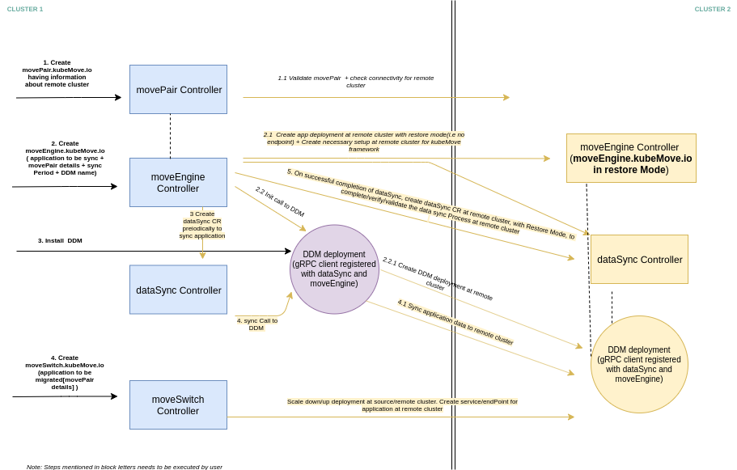

# KubeMove - High Level Design

## Table of Contents

* [Summary](#summary)
* [Motivation](#motivation)
    * [Goals](#goals)
    * [Non-Goals](#non-goals)
    * [User Stories](#user-stories)
* [Proposal](#proposal)
    * [Implementation Details/Notes/Constraints](#implementation-detailsnotesconstraints)
    * [Risks and Mitigations](#risks-and-mitigations)
* [Design acceptance criteria](#design-acceptance-criteria)
* [Implementation History](#implementation-history)

## Summary

Mobility of applications is a need that often arises because of many reasons. Developers need an easy way to initiate the mobility, monitor the progress and manage the entire process. This KEP is a proposal of the architecture and design of the KubeMove project which provides an operator and a set of APIs to achieve the required mobility of the applications. KubeMove also proposes a CLI using which developers can invoke the APIs easily and control the mobility workflow. The API set itself is an initial proposal which we expect to evolve during the community collaboration process.

KubeMove proposes an initial set of FOUR APIs and an interface called DDM (Dynamic Data Mobilizer) to implement either application specific or storage specific data mobilizer using which the actual data mobility happens. In this KEP, we cover the high list of use cases for KubeMove.

Proposed KubeMove APIs/CRDs are :

- moveengine.kubemove.io

- movepair.kubemove.io

- datasync.kubemove.io

- moveswitch.kubemove.io

## Motivation

There are tools available for backup and restore. Kubernetes is also working on the APIs for backup and restore. However, there is a need to orchestrate the entire mobility	flow across provider boundaries in order to get the applications moved between the user's cluster which may be across the clouds or hybrid cloud environments. Cloud provider or a middleware has to coordinate the data mobility between the end points. The motivation for this project is to identify and collaborate such API with the interested providers and middleware providers.

### Goals

- Identify the mobility workflow with provider or middleware software in the middle
- Identify the interfaces to invoke and monitor the mobility process by the end users such as application developers
- Identify the list of CLIs the users can use to move and monitor the applications

### Non-Goals

- Networking connectivity between the two end points. This is done external to KubeMove. There are new interesting projects like [Rancher Submariner](https://github.com/rancher/submariner) which may be adopted to handle the connections between the source and destination
- Authentication and authorization. This is also done external to KubeMove. Technologies like Istio, Envoy, Federation will be part of the authentication and authorization.

### User Stories

- Hybrid and multi-cloud deployments - Move applications on-prem to cloud or vice-versa or from cloud-cloud
- Onramp to Kubernetes - KubeMove can help migrate the data from legacy volumes onto Kubernetes
- Kubernetes and/or application upgrades - Applications may need to be moved back and forth while following blue green strategy

## Proposal

User treats application mobility as a need to move the application from one place to another rather than treating the process as a backup and restore. For this reason, there are two types of interfaces that are being proposed.

1. APIs for the end user to interact with the application and the data mobilizer
2. APIs for the cloud provider or the middleware to control the data mobility flow where they can also control authentication and authorization when and if needed

KubeMove operator has a set of controllers that watch the following CRs and implement the overall mobility workflow.

There are four initial APIs that are being proposed:

1. **KubeMoveEngine:**

This CRD defines the placeholders for the workflow for a given application. The CR is created by the user by invoking the spec that has the following details
   - Application to which this CR applies
   - Target location including the namespace. User can specify multiple target locations, in which case multiple KMovePair CRs get created.
   - The Dynamic Data Mobilizer or DDM details
   - schedule time to transfer data at regular interval
   - Telemetry management

`MoveEngine` controller that is watching this CR will deploy the KubeMove framework(`MoveEngine`, `DataSync` controller) at remote cluster to
setup the application and transfer the data to remote cluster. This controller creates the datasync CR periodically and invokes the `DataSync`
controller to initiate the data transfer through DDM. Once DDM completes the data transfer, `MoveEngine` controller updates the remote `DataSync` controller by creating dataSync CR at remote cluster to validate/verify the data transfer.

2. **KubeMovePair:**

This CRD defines the data channel between the source and destination endpoints. As indicated in the non-goals section of this document, setting up of the actual communication channel is not in the scope of KubeMove, it is done external to KubeMove. `KubeMovePair` contains the status of the data channel (init, active, offline).

3. **DataSync:**

`DataSync` CRD defines the list of volumes needs to be synced to remote cluster.

`DataSync` controller watches for this CR and invokes the DDM to initiate the data transfer. dataSync CR provides the granular status, of the data transfer, from DDM.

 This CRD defines the interface that DDM implementors have to expose. At the end of a successful data channel creation between the two end points, `DataSync` CR is created by the DDM. This CR provides granular status of the data channel. DDM is either application specific or storage vendor specific. For example, a PostgreSQL DDM may establish the data channel on top of a `KubeMovePair` and manage the async snapshots to be transferred at regular interval from source to destination.

4. **KubeMoveSwitch:**

This CRD is defined for completing the application mobility part, from source to target. The controller watching the CR handles the flow of bringing down the source application and enabling the target application with the required spec. If any change to the application that needs to be applied on the target side, that change is handled through this CRD. The target side switch hooks provide post switch execution scripts like changing the ingress or istio configuration etc.

**DDM**

DDM stands for Dynamic Data Mobilizer. Communication between KubeMove framework and DDM is achieved through gRPC protocol. DDM register its capabilities with `MoveEngine` and `DataSync` controller. Application developers or application vendors or cloud providers or storage providers may write their own DDM implementations to handle the data sync between source and target end points.

DDM must support following interfaces:
  1. INIT

    This interface is invoked by `MoveEngine` controller. Through this interface, DDM may deploy the additional resources at remote cluster for data transfer

  2. SYNC

    This interface is invoked by `DataSync` controller to initiate the data transfer to remote cluster

  3. STATUS

    This interface is invoked by `DataSync` controller to fetch the status of data transfer.

**High-level workflow:**

**KubeMove interaction with the end user:**

End user invokes the data mobility flow by inserting the annotation `kubemove.io/kubemove.enable="true"`. In addition, the user also identifies the name of the KubeMoveEngine that handles the mobility by using the annotation `kubemove.io/engine="myBusyBoxKMEngine"` . These two annotations together provide an entry point of KubeMove to the application mobility. User then invoke the KubeMoveEngine to specify the details of required application mobility.

**KubeMove interaction with cloud provider:**

Cloud provider may interact with KubeMovePair for monitoring the status and invoke KubeMoveSwitch either automatically or by interacting with the user.  Cloud provider can also participate in the manipulation of KubeMoveSwitch CRs.

### Implementation Details/Notes/Constraints

KubeMove project defines the spec for the CRDs and implements the controllers to handle the end-to-end application mobility. We also plan to implement a reference DDM that handles the data sync between source and target using restic.

### Risks and Mitigation

Establishing the secure communication between the end points across boundaries can pose as a challenge. The actual secure channel establishment is not in the scope of KubeMove but needs to be given a complete thought for data security on the wire.

## Design acceptance criteria

This KEP is in provisional state. To move the design into `accepted` state, at least two sponsors are needed as design approvers from two different companies.

## Implementation History

- None

